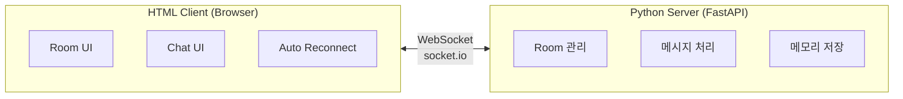

# WebSocket 채팅 시스템 구현 전략

## 📋 Overview

Python 기반의 간단한 로컬 WebSocket 채팅 서버와 단일 HTML 파일 클라이언트로 구성된 실습용 실시간 채팅 시스템 구현 전략

**핵심 철학**: 최소 의존성, 최대 단순성

---

## 🏗️ 전체 아키텍처



---

## 🖥️ 서버 구현 전략

### 기술 스택

```python
# requirements.txt
fastapi==0.104.1
python-socketio==5.10.0
uvicorn[standard]==0.24.0
```

### 핵심 컴포넌트

**1. FastAPI 앱 + SocketIO 서버**

- FastAPI로 HTTP 서버 (정적 파일 제공)
- python-socketio로 WebSocket 처리
- CORS 설정으로 로컬 개발 지원

**2. 메모리 기반 데이터 구조**

```python
rooms = {
    "roomId": {
        "users": ["user-1234", "user-5678"],
        "messages": [...]  # 최근 50개
    }
}
user_sessions = {
    "session_id": {
        "nickname": "user-1234",
        "current_room": "roomId"
    }
}
```

**3. 이벤트 핸들러**

- `connect`: 닉네임 생성 및 세션 저장
- `join_room`: Room 입장, 히스토리 전송, 시스템 메시지
- `send_message`: 메시지 브로드캐스트 및 히스토리 저장
- `leave_room`: Room 퇴장, 빈 방 정리
- `disconnect`: 연결 종료 처리

### 프로젝트 구조

```
chat-server/
├── server.py           # 메인 서버 로직
├── requirements.txt    # Python 패키지
└── public/
    └── index.html      # 클라이언트 파일
```

### 실행 방법

```bash
# 1. 가상환경 생성 (선택)
python -m venv venv
source venv/bin/activate  # Windows: venv\Scripts\activate

# 2. 패키지 설치
pip install -r requirements.txt

# 3. 서버 실행
python server.py

# 4. 브라우저에서 접속
# http://localhost:8000
```

---

## 💻 클라이언트 구현 전략

### 기술 스택

- **HTML + CSS + Vanilla JavaScript**
- **socket.io-client CDN** (번들러 불필요)
- 단일 파일로 구성

### 핵심 기능 구현

**1. UI 구성**

```html
<!-- 연결 상태 표시 -->
<div id="status">연결 중...</div>

<!-- Room 선택/생성 -->
<input id="roomInput" placeholder="Room ID" />
<button id="joinBtn">입장</button>

<!-- 메시지 영역 -->
<div id="messages"></div>

<!-- 메시지 입력 -->
<textarea id="messageInput"></textarea>
<button id="sendBtn">전송</button>
```

**2. Socket.IO 연결 및 이벤트**

```javascript
const socket = io('http://localhost:8000');

// 연결 상태
socket.on('connect', () => {
  /* 상태 업데이트 */
});
socket.on('disconnect', () => {
  /* 재연결 로직 */
});

// 채팅 이벤트
socket.on('room_joined', (data) => {
  /* 히스토리 로드 */
});
socket.on('new_message', (msg) => {
  /* 메시지 표시 */
});

// 메시지 전송
socket.emit('send_message', { roomId, text });
```

**3. 자동 재연결**

```javascript
let lastRoomId = localStorage.getItem('lastRoom');

socket.on('connect', () => {
  if (lastRoomId) {
    socket.emit('join_room', { roomId: lastRoomId });
  }
});
```

**4. 메시지 스타일링**

- CSS Flexbox로 좌/우 정렬
- 시스템 메시지는 중앙 정렬 + 회색

---

## 🔄 구현 단계

### Phase 1: 기본 서버 구현 (30분)

1. FastAPI + SocketIO 서버 셋업
2. 정적 파일 서빙 설정
3. 기본 연결/연결 해제 이벤트 처리
4. 닉네임 자동 생성 로직

### Phase 2: Room 기능 구현 (45분)

1. Room 입장/퇴장 이벤트
2. Room별 사용자 관리
3. 빈 방 자동 삭제
4. 시스템 메시지 생성

### Phase 3: 메시지 처리 (30분)

1. 메시지 수신 및 브로드캐스트
2. 메시지 히스토리 저장 (최근 50개)
3. 새 사용자에게 히스토리 전달
4. 메시지 포맷 검증

### Phase 4: 클라이언트 구현 (60분)

1. HTML/CSS 레이아웃
2. Socket.IO 연결 및 이벤트 바인딩
3. Room 입장/퇴장 UI
4. 메시지 송수신 UI
5. 자동 재연결 로직

### Phase 5: 테스트 및 개선 (30분)

1. 다중 탭/브라우저 테스트
2. 연결 끊김/재연결 테스트
3. 메시지 순서 및 히스토리 확인
4. UX 개선 (Enter 전송, 스크롤 등)

---

## 🎯 핵심 구현 포인트

### 서버측

**닉네임 생성**

```python
import uuid

def generate_nickname():
    return f"user-{str(uuid.uuid4())[:8]}"
```

**메시지 히스토리 관리**

```python
def add_message_to_history(room_id, message):
    if room_id not in rooms:
        rooms[room_id] = {"users": [], "messages": []}

    rooms[room_id]["messages"].append(message)

    # 최근 50개만 유지
    if len(rooms[room_id]["messages"]) > 50:
        rooms[room_id]["messages"] = rooms[room_id]["messages"][-50:]
```

**Room 정리**

```python
def cleanup_empty_room(room_id):
    if room_id in rooms and len(rooms[room_id]["users"]) == 0:
        del rooms[room_id]
```

### 클라이언트측

**메시지 표시 (좌/우 정렬)**

```javascript
function displayMessage(msg) {
  const div = document.createElement('div');
  div.className =
    msg.sender === myNickname
      ? 'my-message'
      : msg.type === 'system'
      ? 'system-message'
      : 'other-message';
  div.textContent = `[${msg.sender}] ${msg.text}`;
  messagesDiv.appendChild(div);
  messagesDiv.scrollTop = messagesDiv.scrollHeight;
}
```

**Enter 전송 / Shift+Enter 줄바꿈**

```javascript
messageInput.addEventListener('keydown', (e) => {
  if (e.key === 'Enter' && !e.shiftKey) {
    e.preventDefault();
    sendMessage();
  }
});
```

**탭 종료 시 정리**

```javascript
window.addEventListener('beforeunload', () => {
  if (currentRoom) {
    socket.emit('leave_room', { roomId: currentRoom });
  }
});
```

---

## 🚀 실행 및 테스트

### 서버 실행

```bash
cd chat-server
python server.py
```

출력:

```
INFO:     Started server process
INFO:     Uvicorn running on http://localhost:8000
```

### 클라이언트 접속

1. 브라우저에서 `http://localhost:8000` 열기
2. Room ID 입력 (예: `room1`)
3. 입장 버튼 클릭
4. 메시지 입력 및 전송

### 다중 사용자 테스트

- 다른 탭 또는 시크릿 모드에서 동일 URL 접속
- 같은 Room ID로 입장
- 메시지 송수신 확인

---

## ⚙️ 선택적 개선 사항

### 추가 기능 (필요시)

- **Room 목록 표시**: 현재 활성화된 Room 목록
- **사용자 수 표시**: Room별 참여자 수
- **타이핑 인디케이터**: "user-1234 is typing..."
- **읽음 표시**: 메시지 읽음/안읽음
- **닉네임 변경**: 사용자가 직접 닉네임 설정

### 성능 최적화

- 메시지 가상 스크롤 (많은 메시지 처리)
- Room별 메시지 캐시 전략
- 연결 풀링 및 타임아웃 설정

---

## 🔗 Related Concepts

- [[Requirement]] - 프로젝트 요구사항
- WebSocket vs HTTP Long Polling
- Socket.IO Room 개념
- 실시간 통신 프로토콜

---

## 📝 Key Takeaways

### 🔑 핵심 구현 포인트

1. **간단함이 최고**: 로컬 실습용이므로 인증, DB, 배포 등 복잡한 요소 제거
2. **메모리 기반 저장**: 재시작 시 데이터 손실되지만 구조가 단순함
3. **단일 파일 클라이언트**: CDN 사용으로 빌드 과정 불필요

### 🎯 학습 목표

- WebSocket 실시간 통신 원리 이해
- Socket.IO Room 개념과 브로드캐스트 메커니즘
- 클라이언트-서버 이벤트 기반 통신 패턴
- 재연결 및 상태 관리 로직
